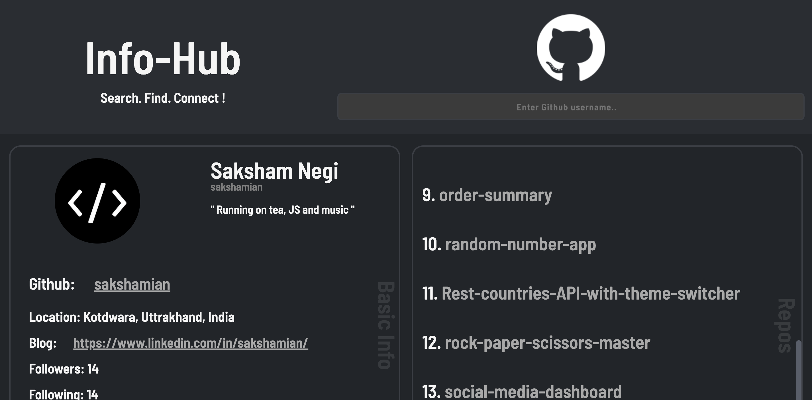

# Github-User-Info

This webapp enables you to search any github user by their username and then check out their basic info and repositories. It makes use of **Github API** to extract data.

## Live Link

[Click Here ➡️](https://sakshamian.github.io/Info-hub/)

# About Project

### Tech Stack Used:
* HTML
* CSS
* Vanilla Js

### Features
* User can Signup and Login, login credentials will be stored in Localstorage.
* User can increase/decrease the quantity of clothes to be washed, iron or dry clean.
* Total amount will be displayed on the cart.
* User can logout and login again, his/her previous orders(not yet ordered) will be reserved on the Localstorage.

### Sample Image

 
 <strong> Desktop View</strong>

 
